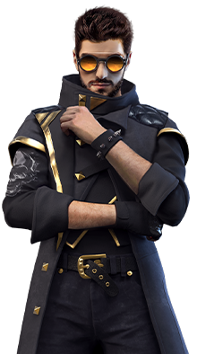
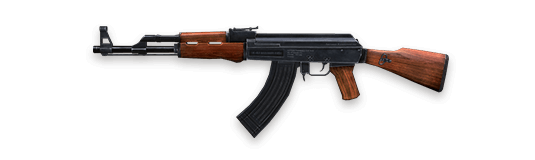
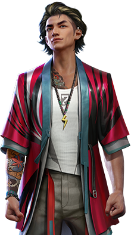
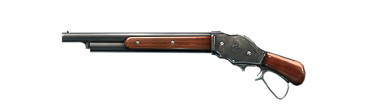
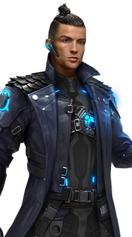
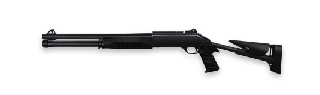

# 🎮 Kho Tài Nguyên Free Fire Assets

<p align="center">
  
  
  
  
  
</p>

<p align="center">
  <b>Bộ sưu tập đầy đủ hình ảnh tài nguyên game Garena Free Fire định dạng PNG tách nền chất lượng cao.</b><br/>
  <i>Dành cho lập trình viên, nhà phát triển bot Discord/Telegram, ban tổ chức giải đấu, thiết kế đồ họa và quản trị viên wiki/cộng đồng.</i>
</p>

<p align="center">
  <b>Ngôn ngữ / Language:</b><br/>
  <a href="README.vi.md"><b>Tiếng Việt (Vietnamese)</b></a> • <a href="README.md"><b>English (Tiếng Anh)</b></a>
</p>

<p align="center">
  
  
  
  
  
</p>

---

## 📑 Mục lục

- [Giới thiệu tổng quan](#-giới-thiệu-tổng-quan)
- [Xem trước hình ảnh](#️-xem-trước-hình-ảnh)
- [Cấu trúc thư mục & Danh mục tài nguyên](#-cấu-trúc-thư-mục--danh-mục-tài-nguyên)
  - [1. Nhân vật (`Character/`)](#1-nhân-vật-character)
  - [2. Vũ khí (`Weapons/`)](#2-vũ-khí-weapons)
  - [3. Trang bị sinh tồn (`Loadouts/`)](#3-trang-bị-sinh-tồn-loadouts)
  - [4. Ảnh đại diện nhân vật (`HeadPics/`)](#4-ảnh-đại-diện-nhân-vật-headpics)
- [Hướng dẫn sử dụng & Tích hợp](#-hướng-dẫn-sử-dụng--tích-hợp)
  - [Cách 1: Clone hoặc tải về máy](#cách-1-clone-hoặc-tải-về-máy)
  - [Cách 2: Sử dụng qua CDN miễn phí (jsDelivr)](#cách-2-sử-dụng-qua-cdn-miễn-phí-jsdelivr-khuyên-dùng-cho-web--bot)
  - [Cách 3: Đường dẫn Raw từ GitHub](#cách-3-đường-dẫn-raw-từ-github)
- [Mã nguồn mẫu](#-mã-nguồn-mẫu)
  - [HTML / Website](#html--website)
  - [React / Next.js](#react--nextjs)
  - [Bot Discord (Node.js / Discord.js)](#bot-discord-nodejs--discordjs)
  - [Bot Discord (Python / discord.py)](#bot-discord-python--discordpy)
- [Quy chuẩn chất lượng tài nguyên](#-quy-chuẩn-chất-lượng-tài-nguyên)
- [Hướng dẫn đóng góp (Contributing)](#-hướng-dẫn-đóng-góp-contributing)
- [Tuyên bố pháp lý & Bản quyền](#️-tuyên-bố-pháp-lý--bản-quyền)
- [Tác giả & Lời cảm ơn](#-tác-giả--lời-cảm-ơn)

---

## 🌟 Giới thiệu tổng quan

**FreeFireAssets** là kho lưu trữ tài nguyên hình ảnh được trích xuất, cắt tỉa và tối ưu kỹ lưỡng từ tựa game **Garena Free Fire**. Toàn bộ tài nguyên đều có nền trong suốt (`.png`), phân chia thư mục rõ ràng, rất tiện lợi cho các dự án:

- 🤖 **Chatbot mạng xã hội**: Bot Discord, Telegram, Zalo, Messenger (tra cứu thông số nhân vật, vũ khí, kỹ năng, tỷ lệ thắng).
- 🏆 **Livestream & Thể thao điện tử (Esports)**: Bảng điểm giải đấu, khung hiển thị tỉ số, overlay livestream, luồng thông báo hạ gục (kill feed).
- 🌐 **Website & Ứng dụng**: Website xây dựng combo kỹ năng (Skill Builder), tạo bảng xếp hạng (Tier List), cẩm nang game Wiki.
- 📱 **Ứng dụng di động & Desktop**: Ứng dụng tra cứu mẹo chơi, máy tính sát thương vũ khí.
- 🎨 **Thiết kế đồ họa**: Thiết kế thumbnail YouTube/TikTok, ảnh bìa, poster sự kiện, đồ họa mạng xã hội.

---

## 🖼️ Xem trước hình ảnh

| Kỹ năng chủ động | Kỹ năng bị động | Vũ khí | Vũ khí nâng cấp | Trang bị sinh tồn |
| :---: | :---: | :---: | :---: | :---: |
|  |  |  |  |  |
| **Alok** *(Chủ động)* | **Kelly Thức tỉnh** *(Bị động)* | **AK47** *(Súng trường)* | **M1014-III** *(Shotgun cấp 3)* | **Chợ chiến thuật** |

---

## 📁 Cấu trúc thư mục & Danh mục tài nguyên

### Bảng thống kê tài nguyên

| Thư mục | Số lượng | Mô tả chi tiết | Định dạng | Độ trong suốt |
| :--- | :---: | :--- | :---: | :---: |
| `Character/Active/` | **23** | Ảnh nhân vật kỹ năng chủ động (Full body) | PNG | ✅ 32-bit ARGB |
| `Character/Passive/` | **44** | Ảnh nhân vật kỹ năng bị động & Thức tỉnh | PNG | ✅ 32-bit ARGB |
| `HeadPics/` | **80** | Ảnh đại diện khuôn mặt theo ID vật phẩm game | PNG | ✅ 32-bit ARGB |
| `Loadouts/` | **4** | Biểu tượng vật phẩm mang theo sinh tồn | PNG | ✅ 32-bit ARGB |
| `Weapons/` | **90** | Tất cả các dòng súng, cận chiến, lựu đạn, bản Vàng & Nâng cấp | PNG | ✅ 32-bit ARGB |
| **Tổng cộng** | **241** | **Tài nguyên sẵn sàng sử dụng ngay** | **PNG** | **100% Alpha** |

```
FreeFireAssets/
├── Character/
│   ├── Active/         # 23 nhân vật kỹ năng chủ động (Alok, Chrono, Tatsuya, K...)
│   └── Passive/        # 44 nhân vật kỹ năng bị động & Thức tỉnh (Kelly, Hayato, Alvaro...)
├── HeadPics/           # 80 ảnh đại diện nhân vật định danh theo ID (902000006.png...)
├── Loadouts/           # 4 biểu tượng trang bị sinh tồn chiến thuật
└── Weapons/            # 90 mẫu vũ khí (Súng trường, Tiểu liên, Shotgun, Súng ngắm, bản Vàng...)
```

---

### 1. Nhân vật (`Character/`)

#### ⚡ Kỹ năng chủ động (`Character/Active/` — 23 tệp)
Các nhân vật có kỹ năng chủ động cần kích hoạt thủ công trong trận và có thời gian hồi chiêu:
- `A124.png`, `Alok.png`, `Alok Awaken.png`, `Chrono.png`, `Clu.png`, `Dimitri.png`, `Homer.png`, `Ignis.png`, `Iris.png`, `K.png`, `Kassie.png`, `Kenta.png`, `Koda.png`, `Nero.png`, `Orion.png`, `Oscar.png`, `Ryden.png`, `Santino.png`, `Skyler.png`, `Steffie.png`, `Tatsuya.png`, `Wukong.png`, `Xayne.png`

#### 🛡️ Kỹ năng bị động (`Character/Passive/` — 44 tệp)
Các nhân vật có kỹ năng bị động kích hoạt tự động theo điều kiện trong trận đấu, bao gồm các phiên bản Thức tỉnh:
- **Nhân vật Thức tỉnh (Awaken)**: `Alvaro Awaken.png`, `Andrew Awaken.png`, `Hayato Awaken.png`, `Kelly Awaken.png`, `Moco Awaken.png`
- **Nhân vật bị động tiêu chuẩn**: `Alvaro.png`, `Andrew.png`, `Antonio.png`, `Caroline.png`, `D-bee.png`, `Dasha.png`, `Ford.png`, `Hayato.png`, `J.Biebs.png`, `Jai.png`, `Joseph.png`, `Jota.png`, `Kairos.png`, `Kapella.png`, `Kelly.png`, `Kla.png`, `Laura.png`, `Leon.png`, `Lila.png`, `Luna.png`, `Luqueta.png`, `Maro.png`, `Maxim.png`, `Miguel.png`, `Misha.png`, `Moco.png`, `Nairi.png`, `Nikita.png`, `Notora.png`, `Olivia.png`, `Otho.png`, `Paloma.png`, `Rafael.png`, `Shani.png`, `Shirou.png`, `Sonia.png`, `Suzy.png`, `Thiva.png`, `Wolfrahh.png`

---

### 2. Vũ khí (`Weapons/`)

Bao gồm **90** hình ảnh vũ khí với độ sắc nét cao chia theo các lớp trang bị:

| Phân loại | Danh sách vũ khí |
| :--- | :--- |
| **Súng trường tấn công (AR)** | `AK47`, `AN94`, `AUG`, `FAMAS`, `G36`, `GROZA`, `GROZA-X`, `KINGFISHER`, `M14`, `M4A1`, `M4A1-X`, `M4A1-Y`, `M4A1-Z`, `PARAFAL`, `SCAR`, `SCAR-I`, `SCAR-II`, `SCAR-III`, `XM8` |
| **Súng ngắm & Xạ thủ (Sniper/DMR)** | `AC80`, `AWM`, `KAR98K`, `M24`, `M82B`, `HEALINGSNIPER`, `SKS`, `SVD`, `SVD-Y`, `VSS`, `WOODPECKER` |
| **Súng tiểu liên (SMG)** | `BIZON`, `CG15`, `MAC10`, `MP40`, `MP5`, `P90`, `THOMPSON`, `UMP`, `VECTOR` |
| **Súng săn (Shotgun)** | `CHARGE BUSTER`, `M1014`, `M1014-I`, `M1014-II`, `M1014-III`, `M1873`, `M1887`, `M1887TD`, `MAG7`, `SPAS12`, `TROGON`, `TROGUNSHOTGUN` |
| **Súng lục (Pistol)** | `G18`, `M1917`, `M500`, `USP`, `UZI` |
| **Súng máy & Hạng nặng** | `CROSSBOW`, `FLAMETHROWER`, `GATLING`, `KORD`, `M249`, `M60`, `M79`, `MGL140`, `RGS50` |
| **Cận chiến & Lựu đạn** | `MACHETE`, `SCYTHE`, `GRENADE`, `FLASH FREEZE`, `SMOKE GRENADE` |
| **Phiên bản Vàng & Nâng cấp (Gold / Upgraded)** | `GOLDAWM`, `GOLDFAMAS`, `GOLDFAMAS-II`, `GOLDFAMAS-III`, `GOLDKAR98K`, `GOLDKAR98K-II`, `GOLDKAR98K-III`, `GOLDM14`, `GOLDM14-II`, `GOLDM14-III`, `GOLDM249-X`, `GOLDM60`, `GOLDM60-II`, `GOLDM60-III`, `GOLDMP5`, `GOLDMP5-II`, `GOLDMP5-III`, `GOLDVSS`, `GOLDVSS-II`, `GOLDVSS-III` |

---

### 3. Trang bị sinh tồn (`Loadouts/`)

Các biểu tượng vật phẩm chiến thuật hỗ trợ trước khi vào trận (kích thước 230×230 PNG trong suốt):
- `Enhance Hammer.png` — Búa nâng cấp giáp
- `Super Leg Pockets.png` — Túi chân siêu cấp (tăng sức chứa balo)
- `Tactical Market.png` — Chợ chiến thuật (mua trang bị tức thì)
- `Team Booster.png` — Tăng lực đồng đội

---

### 4. Ảnh đại diện nhân vật (`HeadPics/`)

Gồm **80** hình đại diện chân dung (kích thước 110×110 PNG trong suốt), đặt tên theo mã định danh vật phẩm gốc trong Free Fire:
- Ví dụ: `902000006.png`, `902000007.png`, `902000008.png`, ..., `902052025.png`
- Rất phù hợp để hiển thị avatar người chơi trong bảng xếp hạng, hồ sơ cá nhân hoặc quản lý thành viên Quân Đoàn.

---

## 🚀 Hướng dẫn sử dụng & Tích hợp

### Cách 1: Clone hoặc tải về máy

Tải toàn bộ mã nguồn và kho tài nguyên về máy cục bộ:

```bash
git clone https://github.com/iamdinhduchuy/FreeFireAssets.git
```

Hoặc tải tệp nén ZIP trực tiếp từ nút **Code** -> **Download ZIP** trên giao diện GitHub.

---

### Cách 2: Sử dụng qua CDN miễn phí (jsDelivr) *(Khuyên dùng cho Web & Bot)*

Bạn có thể liên kết trực tiếp tới bất kỳ ảnh nào thông qua mạng phân phối nội dung toàn cầu **jsDelivr** (tốc độ cao, có cache và hoàn toàn miễn phí) mà không cần tự lưu trữ file:

**Cấu trúc đường dẫn CDN:**
```
https://cdn.jsdelivr.net/gh/iamdinhduchuy/FreeFireAssets@main/<THƯ_MỤC>/<TÊN_TỆP>.png
```

> **Lưu ý**: Với các tên tệp có khoảng trắng, hãy thay thế bằng mã `%20` (ví dụ: `Alok%20Awaken.png`).

**Ví dụ đường dẫn CDN trực tiếp:**
- **Alok**: `https://cdn.jsdelivr.net/gh/iamdinhduchuy/FreeFireAssets@main/Character/Active/Alok.png`
- **AK47**: `https://cdn.jsdelivr.net/gh/iamdinhduchuy/FreeFireAssets@main/Weapons/AK47.png`
- **Kelly Thức tỉnh**: `https://cdn.jsdelivr.net/gh/iamdinhduchuy/FreeFireAssets@main/Character/Passive/Kelly%20Awaken.png`
- **Chợ chiến thuật**: `https://cdn.jsdelivr.net/gh/iamdinhduchuy/FreeFireAssets@main/Loadouts/Tactical%20Market.png`
- **Avatar ID**: `https://cdn.jsdelivr.net/gh/iamdinhduchuy/FreeFireAssets@main/HeadPics/902000006.png`

---

### Cách 3: Đường dẫn Raw từ GitHub

Truy cập trực tiếp thông qua máy chủ lưu trữ Raw của GitHub:

```
https://raw.githubusercontent.com/iamdinhduchuy/FreeFireAssets/main/<THƯ_MỤC>/<TÊN_TỆP>.png
```

Ví dụ:
```
https://raw.githubusercontent.com/iamdinhduchuy/FreeFireAssets/main/Weapons/M1887.png
```

---

## 💻 Mã nguồn mẫu

### HTML / Website

```html
<!-- Thẻ hiển thị nhân vật -->
<div class="character-card">
  
  <h3>Tatsuya</h3>
</div>

<!-- Thẻ hiển thị vũ khí -->
<div class="weapon-item">
  
</div>
```

### React / Next.js

```jsx
import React from 'react';

const CDN_BASE = 'https://cdn.jsdelivr.net/gh/iamdinhduchuy/FreeFireAssets@main';

export const WeaponBadge = ({ weaponName }) => {
  const imageUrl = `${CDN_BASE}/Weapons/${encodeURIComponent(weaponName)}.png`;

  return (
    <div className="weapon-badge">
      
      <span>{weaponName}</span>
    </div>
  );
};
```

### Bot Discord (Node.js / Discord.js)

```javascript
const { EmbedBuilder } = require('discord.js');

const characterEmbed = new EmbedBuilder()
  .setTitle('Alok (Giai Điệu Sinh Mệnh)')
  .setColor(0x00FF88)
  .setDescription('Tạo hào quang 5m tăng tốc độ di chuyển và hồi máu liên tục cho bản thân và đồng đội.')
  .setImage('https://cdn.jsdelivr.net/gh/iamdinhduchuy/FreeFireAssets@main/Character/Active/Alok.png')
  .setThumbnail('https://cdn.jsdelivr.net/gh/iamdinhduchuy/FreeFireAssets@main/HeadPics/902000006.png');

channel.send({ embeds: [characterEmbed] });
```

### Bot Discord (Python / discord.py)

```python
import discord

embed = discord.Embed(
    title="Thông số vũ khí AK47",
    description="Súng trường tấn công có sát thương cực cao và độ giật lớn.",
    color=discord.Color.red()
)
embed.set_image(url="https://cdn.jsdelivr.net/gh/iamdinhduchuy/FreeFireAssets@main/Weapons/AK47.png")

await ctx.send(embed=embed)
```

---

## 📐 Quy chuẩn chất lượng tài nguyên

Mọi tài nguyên trong kho lưu trữ này đều tuân thủ các tiêu chuẩn sau:

1. **Định dạng**: Portable Network Graphics (`.png`).
2. **Hệ màu**: 32-bit ARGB với kênh trong suốt (Alpha) sạch sẽ, không có viền răng cưa hay vệt trắng dư thừa.
3. **Cắt viền**: Được cắt sát biên hình ảnh (tight bounding crop), không để diện tích trong suốt thừa thãi.
4. **Quy tắc đặt tên**:
   - Tên vũ khí: Viết hoa hoặc PascalCase theo chuẩn tên trong game (ví dụ: `M1014-III.png`, `AK47.png`).
   - Tên nhân vật: Đúng tên tiếng Anh chính thức trong game (ví dụ: `Tatsuya.png`, `Kelly Awaken.png`).
   - Trang bị sinh tồn: Viết hoa chữ cái đầu từng từ (ví dụ: `Tactical Market.png`).
   - Ảnh đại diện: Định dạng chuỗi số 9 chữ số theo ID trong dữ liệu game (ví dụ: `902000006.png`).

---

## 🤝 Hướng dẫn đóng góp (Contributing)

Cộng đồng luôn hoan nghênh sự đóng góp từ bạn! Nếu bạn có hình ảnh tài nguyên các nhân vật hoặc súng mới từ các bản cập nhật OB gần nhất:

1. **Fork** kho lưu trữ này về tài khoản GitHub của bạn.
2. **Tạo một nhánh (branch)** mới cho cập nhật:
   ```bash
   git checkout -b feat/them-nhan-vat-moi
   ```
3. **Thêm tài nguyên** vào đúng thư mục:
   - Đảm bảo hình ảnh có **nền trong suốt** (`.png`).
   - Khử sạch điểm ảnh thừa ở viền và giữ đúng tỉ lệ gốc.
   - Tuân thủ quy tắc đặt tên đã nêu ở trên.
4. **Tạo commit** ghi rõ nội dung thay đổi:
   ```bash
   git commit -m "feat(character): bổ sung ảnh nhân vật Orion Thức tỉnh"
   ```
5. **Đẩy (Push)** lên fork và tạo một **Pull Request (PR)** mới!

---

## ⚖️ Tuyên bố pháp lý & Bản quyền

- **Tuyên bố**: Đây là kho lưu trữ **phi thương mại do cộng đồng người hâm mộ tự phát triển**.
- **Quyền sở hữu trí tuệ**: Mọi tài nguyên đồ họa, hình ảnh nhân vật, mô hình vũ khí, logo và nhãn hiệu liên quan tới game Free Fire đều thuộc quyền sở hữu độc quyền của **[Garena International](https://www.garena.sg/)** và **111dots Studio**.
- **Sử dụng hợp pháp (Fair Use)**: Các tài nguyên này được tổng hợp và chia sẻ chỉ nhằm mục đích nghiên cứu, học tập, tạo nội dung cho cộng đồng người chơi và hỗ trợ phát triển các công cụ phi lợi nhuận.
- Nếu bạn là đại diện bản quyền từ Garena và có yêu cầu gỡ bỏ bất kỳ tài nguyên nào, xin vui lòng tạo Issue hoặc liên hệ trực tiếp với người duy trì kho lưu trữ.

---

## 👤 Tác giả & Lời cảm ơn

- **Người quản trị kho lưu trữ**: [iamdinhduchuy](https://github.com/iamdinhduchuy)
- **Kho lưu trữ GitHub**: [iamdinhduchuy/FreeFireAssets](https://github.com/iamdinhduchuy/FreeFireAssets)

⭐ **Nếu kho tài nguyên này hữu ích cho dự án của bạn, hãy ủng hộ tác giả bằng cách nhấn nút Star trên GitHub nhé!**
